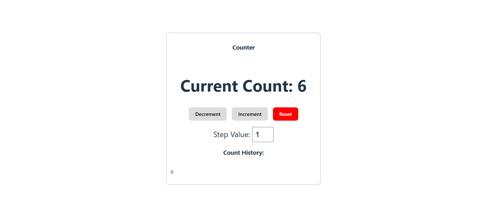

## Title

React Advanced Counter (Hooks, Effects, Local Storage)

## My Solution ScreenShot

## The challenge

This project is a React + TypeScript application that builds an advanced counter using React Hooks. The application supports incrementing and decrementing by a configurable step value, tracks count history, responds to keyboard events, persists state using localStorage, and properly manages side effects and cleanup using useEffect.

## Project Goal

React Hooks fundamentals (useState, useEffect)

Functional state updates using previous state values

Managing arrays and derived state

Keyboard event handling with cleanup

LocalStorage persistence

Understanding effect dependencies and cleanup functions

TypeScript typing for state and events

## Getting Started

This project was created using React with TypeScript and Vite.

The application runs locally using the Vite development server.

## Project Requirement

State Management

Uses useState to manage count, step value, and history.

Uses functional updates to ensure state changes are based on previous values.

Maintains an array of historical count values.

Counter Functionality

Increment and decrement buttons update the count.

Step value determines how much the count changes.

Reset button resets count and history.

Keyboard Event Listeners

ArrowUp key increments the count.

ArrowDown key decrements the count.

Keyboard listeners are registered using useEffect.

Cleanup function removes event listeners on unmount or dependency change.

Local Storage Persistence

Count value is saved to localStorage whenever it changes.

State is initialized from localStorage on page load.

Cleanup prevents outdated saves when count changes rapidly.

Reset clears stored data from localStorage.

## Side Effects & Cleanup

useEffect is used only for synchronizing with external systems.

Cleanup functions prevent memory leaks and unnecessary work.

Dependency arrays ensure effects run at the correct times.

## Testing and Validation

Increment and decrement buttons update count correctly.

Step input changes the increment/decrement amount.

Keyboard controls update count and history correctly.

Page refresh restores count from localStorage.

Reset clears count, history, and stored data.

Cleanup functions prevent duplicate listeners or outdated timers.

## Challenges

One of the main challenges in this project was understanding when and when not to use useEffect. Initially, state was being updated inside an effect, which caused cascading render warnings. Learning to initialize state directly using the useState initializer function helped eliminate unnecessary renders and warnings. Another challenge involved managing multiple pieces of related state, especially keeping the count history in sync across button clicks, keyboard events, and resets. Handling keyboard event listeners correctly and ensuring proper cleanup also required careful attention to effect dependencies. By slowing down, reading React’s warnings carefully, and aligning code with React’s mental model, these issues were resolved.

## Reflection

This project significantly improved my understanding of React Hooks and how React manages state and side effects. I learned how to use functional updates to avoid stale state issues and how to properly synchronize React state with external systems like localStorage. Implementing keyboard event listeners reinforced the importance of cleanup functions to prevent memory leaks and unintended behavior. Working through React warnings helped solidify when effects are necessary and when state should be initialized directly. Overall, this project strengthened my confidence in writing predictable, maintainable React components using TypeScript.

## Acknowledgement

This project was completed as part of a structured learning curriculum focused on React Hooks, TypeScript fundamentals, and modern front-end development best practices.

https://ps-lms.vercel.app/curriculum/se/416/lesson-1

https://ps-lms.vercel.app/curriculum/se/416/lesson-2

https://www.w3schools.com/jsref/met_storage_getitem.asp

